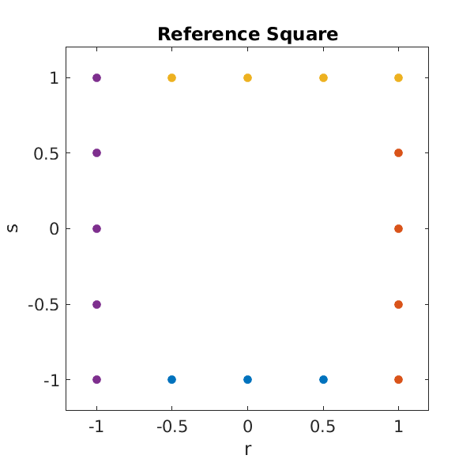
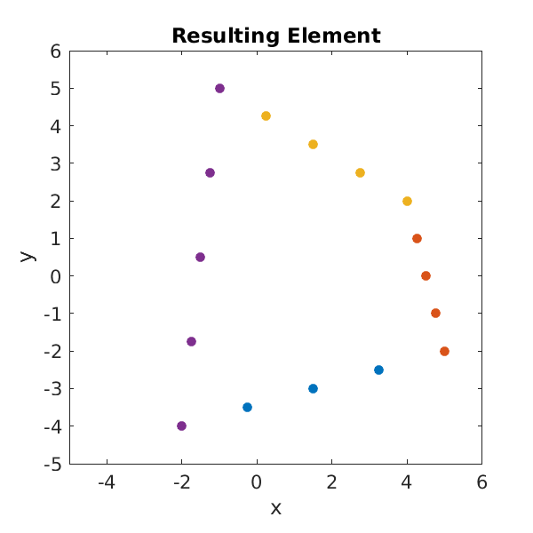

# Homework 5 - 2D DG

## TODO
* ~~Part 1~~
  1. ~~Find mapping~~
  2. ~~Plot mapping~~
* Part 2
  1. ~~Create perturbed grid~~
  2. Calculate Jacobian and integrate
  3. Report: Vary quadrature
  4. Report: Vary element count
* Part 3
  1. Finish Part 2
  2. Compute area of annulus (vary integral for polar coords)
* ~~Part 4~~
  1. ~~Program the Gordon-Hall mapping template~~
  2. ~~Generalize Gordon-Hall for curved edges~~
  3. ~~Compute area of half annulus~~
* ~~Part 5~~
  1. ~~Compute area using line integrals~~
* Part 6
  1. Find 2D coefficients for approximating a function using Legendre fcns (ie: Hwk 3 in 2D)
* Part 7
  1. DG
* Additional
  1. Restructure Homework 4 code into new template
  2. Set up Twilight testing

#### Part 1 Results

